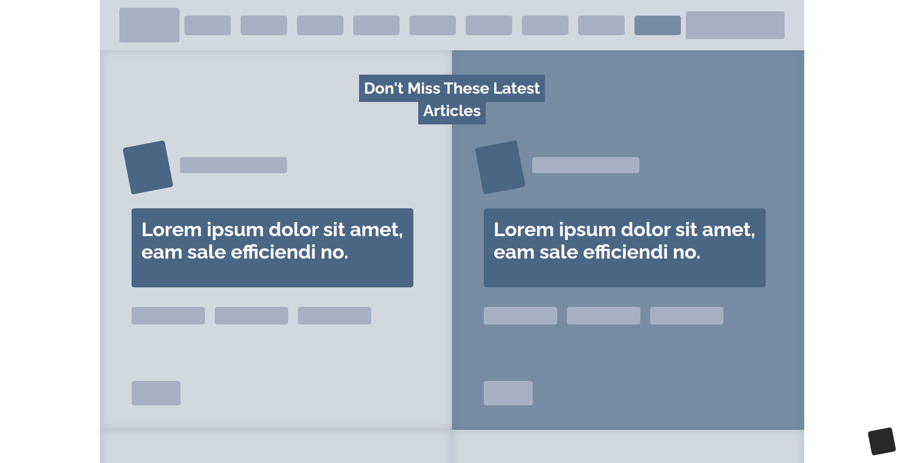

# Design Teardown 

> This project contains a heat map of the [Home Page] (https://www.smashingmagazine.com/) of Smashing Magazine.

## Built With

**HTML**
- Designed in Semantic HTML style.

**CSS**
- Use of typography (fonts imported from google fonts)
- Heavy use of Flexbox, Float and Grid Layout.

## Live Demo

[Live Demo Link](https://smcommits.github.io/Design-Teardown/)

## Getting Started

**User has to clone the repository and run index.html file using any web browser*

## Authors

👤 **Anas Siddiqui**

- GitHub: [Anas Siddiqui](https://github.com/smcommits)

👤 **Dipesh Bajgain**
- GitHub: [@dipbazz](https://github.com/dipbazz )
- Twitter: [@dipbazz](https://twitter.com/dipbazz )
- LinkedIn: [@dipbazz](https://www.linkedin.com/in/dipbazz)

## 🤝 Contributing

Contributions, issues, and feature requests are welcome!

Feel free to check the [issues page](issues/).

## Show your support

Give a ⭐️ if you like this project!

## Acknowledgments

- Fonts are imported from Google Fonts.

## 📝 License

This project is [MIT](lic.url) licensed.
